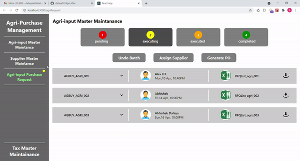

# AgriMan

This project is a CMS implementation in reactJS with various navigation like tab and onPage navigation.This project also uses csv-react to download csv file from JSON data.
###### No CSS framework used.

## Working Model of the app

## Requirements
###### No external/addditional Requirements . Windows supported Single page App. 
 
### <b>Steps to run the app</b> :
###### 1) Clone this repo or Download all the files/folder and run npm install.
###### 2) Then run npm start and open [http://localhost:3000](http://localhost:3000) to view it in the browser. 

This project was bootstrapped with [Create React App](https://github.com/facebook/create-react-app).

